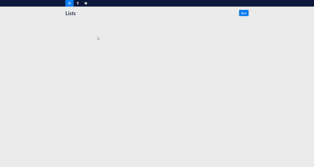

# Elite Four [](https://github.com/GreenT13/elite-four-electron/releases)

Elite Four is a desktop application made for picking favorites out of large lists



Download the latest version from the github release. Inside the application is a help page with details on how everything works!

## Inspiration
It is inspired by the website https://www.dragonflycave.com/favorite.html. It is basically the same application,
but you can now customize which list you input! You can also customize the maximal number of items shown.

## Technical details
### Frameworks
This is an Angular application, using the Electron framework to be used as a desktop application.

### Running locally
```npm run start```

### Creating release
```
npm run electron:windows
```
Identical commands exist for mac and linux.
